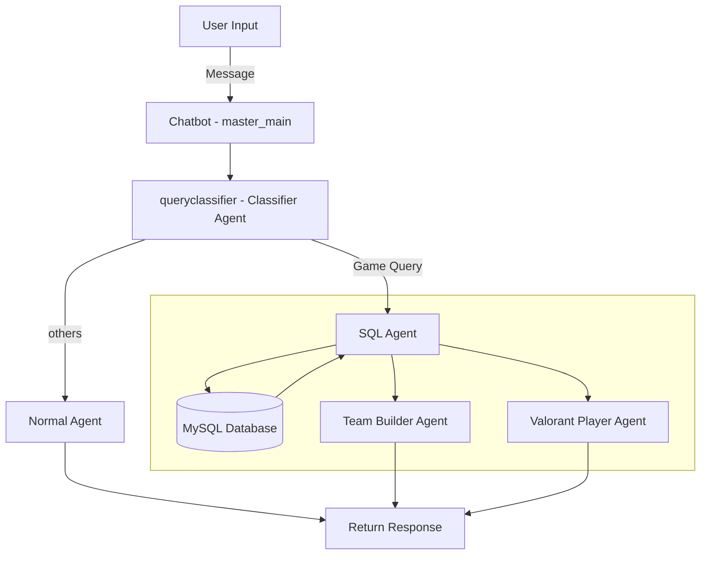

# VCTEVA
Repository for VCT Hackathon: Esports Manager Challenge

## Python Environment Setup

### 1. Conda Environment Set Up

```
conda create --name=eva python=3.10
conda activate eva
pip install -r requirements.txt
```


### 2. Download Dataset From AWS S3 Bucket
We have processed data and saved data as file [all player.json](/DATA/all_players.json) in our project.
We could ues this json file do simple retrieval.
<details>

1. Download Dataset From AWS S3 Bucket

```
git clone https://github.com/Kleinpenny/VCTEVA.git
cd /VCTEVA/Data_Preprocess/
python download_dataset.py
```

2. Preprocess Dataset
TODO: 我们是如何处理数据，一步一步到，最后选手，联赛，年份，地图，比赛这样处理的。
```
cd /VCTEVA/Data_Preprocess/
python main.py
```
3. store data in /DATA/all.players.json
</details>

### 3. MySQL Database
1. Install MYSQL in Linux

```bash
apt-get install mysql-server
apt-get install mysql-client
apt-get install libmysqlclient-dev
```
2. Configure MySQL
```bash
mysql -u root -p
```
When using MySQL for the first time, there is no password set, so just press Enter.

```mysql
ALTER USER 'root'@'localhost' IDENTIFIED WITH mysql_native_password BY 'vcteva_2024';
FLUSH PRIVILEGES;
```

<details>
  <summary>OPTIONAL(or if you encounter login issues)</summary>

- If you need more users, you can create an account like 'admin' and set a password for it:

````mysql
CREATE USER 'admin'@'localhost' IDENTIFIED BY 'PASSWORD';
GRANT ALL PRIVILEGES ON *.* TO 'admin'@'localhost' WITH GRANT OPTION;
FLUSH PRIVILEGES;
````

- If you forget the password for the `root` or `admin` user，you can try the following steps to reset it:
  -  First, stop the MySQL service:
     ```bash
     sudo systemctl stop mysql
     ```
  - Then start MySQL in skip-grant-tables mode:
     ```bash
     sudo mysqld_safe --skip-grant-tables &
     ```
  - Log in to MySQL again, this time without a password:
    ```bash
    mysql -u root
    ```
    
  - Once logged in, reset the password for the `admin` or `root` user:
    ```mysql
    ALTER USER 'root'@'localhost' IDENTIFIED BY 'new_password';
    FLUSH PRIVILEGES;
    ```
  - Finally, restart the MySQL service:
    ```bash
    sudo systemctl start mysql
    ```
</details>

3. Create database and tables
```mysql
Create database VCTEVA;
exit;
mysql -u root -p VCTEVA < VCTEVA/Data_Preprocess/Database/VCTEVA_backup.sql
cd VCTEVA/Data_Preprocess/Database
python db_test.py
```
<details>
  <summary>OPTIONAL(Delete the database)</summary>

```mysql
SET FOREIGN_KEY_CHECKS = 0;
Use VCTEVA;
DELETE FROM PerformanceDetails;
DELETE FROM Summary;
DELETE FROM Agents;
DELETE FROM Maps;
DELETE FROM Tournaments;
DELETE FROM Players;
DELETE FROM DamageDetails;

SET FOREIGN_KEY_CHECKS = 1;
```
</details>

### 4. Configure AWS Bedrock and LLM Client

1. Install AWS CLI
Install the AWS CLI following the (https://docs.aws.amazon.com/cli/latest/userguide/getting-started-install.html)

2. Create an IAM User
In the AWS console under the IAM service, create a new user and obtain the access credentials (Access Key ID and Secret Access Key) for this user.

3. Configure AWS CLI
Open the terminal and run the following command:
   ```
   aws configure
   ```
   Follow the prompts to input your AWS credential information.

4. Verify Credentials
Run the following command to verify if your AWS credentials are correctly configured:
   ```
   aws sts get-caller-identity
   ```
   If the credentials are valid, you will see an output similar to the following:
   ```json
   {
       "UserId": "AIDAI...",
       "Account": "123456789012",
       "Arn": "arn:aws:iam::123456789012:user/username"
   }
   ```
   If the credentials are invalid, you will receive an error message.

After completing these steps, you can use the AWS Bedrock service and the selected LLM client.

### 5. Run the Chatbot

```
python app.py
```

# Project Story

This project implements a flexible and extensible chatbot system that can work with different Large Language Models (LLMs) and incorporate Retrieval-Augmented Generation (RAG) capabilities. The system is designed with modularity and ease of use in mind, allowing for seamless integration of various LLM providers and easy switching between them.
## System Workflow


The following flowchart shows how our chatbot system processes user input and generates responses:



This flowchart illustrates how user input is processed through different agents and decision points to generate the appropriate response.

## Project Components

1. **Master Agent ([Master_Agent.py](/Chatbot/Master_Agent.py))**:  
   Acts as the main agent, dispatching other agents based on the query context.

2. **Classifier Agent**:  
   Determines whether the query is related to Valorant.

3. **Normal Agent**:  
   Handles general chat-related queries.

4. **SQL Agent**:  
   Processes queries that require SQL retrieval and generates SQL queries.

5. **Teambuild Agent & Valorant Agent**:  
   Called by the master agent to handle team-building and Valorant-related queries respectively.

6. **AWS Bedrock LLM Client ([aws_bedrock_client.py](/llm/aws_bedrock.py))**:  
   Uses the AWS Bedrock API to interact with LLaMA 3.1 80B.

7. **Gradio Chatbot Interface ([app.py](app.py))**:  
   Provides the front-end chat UI using Gradio.

8. **Vue Front-End (in progress)**:  
   A more refined UI under development using Vue.


## Key Features

- **Modular Design**: The use of a base class for LLM clients allows for easy addition of new LLM providers without changing the core chatbot logic.
- **Flexible LLM Selection**: Users can easily switch between different LLM providers (e.g., HuggingFace, AWS Bedrock) by changing the client initialization in the main function.
- **RAG Support**: The chatbot can optionally use a Retrieval-Augmented Generation interface to enhance responses with relevant context.
MySQL database

sql agent: generate sql for retrieval automatically


## Challenges we ran into
1. How to design the database structure.
2. 

