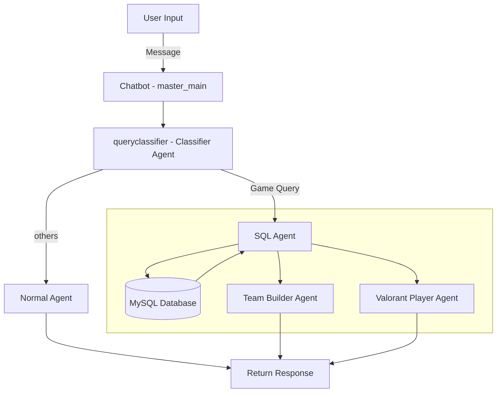

# VCTEVA
Repository for VCT Hackathon: Esports Manager Challenge

## Python Environment Setup

### 1. Python Environment

Set up a Conda environment:

```bash
conda create --name=eva python=3.10
conda activate eva
pip install -r requirements.txt
```

### 2. Data Preparation

We've preprocessed the data and stored it in [all_players.json](/DATA/all_players.json) for simple retrieval.

<details>
<summary>Detailed Data Processing Steps</summary>

1. Download Dataset From AWS S3 Bucket

```bash
git clone https://github.com/Kleinpenny/VCTEVA.git
cd VCTEVA/Data_Preprocess/
python download_dataset.py
```

2. Preprocess the dataset:

```bash
python main.py
```

Our preprocessing pipeline involves:
- Extracting all unique players from all leagues/esports-data
- Iterating through all games to compile player statistics
- Aggregating data on agents, KDA, and other relevant metrics

3. The processed data is stored in [all_players.json](/DATA/all_players.json), containing comprehensive match data for all players.
</details>

### 3. MySQL Database Setup

1. Install MySQL on Linux:

```bash
sudo apt-get install mysql-server mysql-client libmysqlclient-dev
```

2. Configure MySQL:

```bash
mysql -u root -p
```
When using MySQL for the first time, there is no password set, so just press Enter.
```mysql
ALTER USER 'root'@'localhost' IDENTIFIED WITH mysql_native_password BY 'vcteva_2024';
FLUSH PRIVILEGES;
```
<details>
  <summary>OPTIONAL(or if you encounter login issues)</summary>

- If you need more users, you can create an account like 'admin' and set a password for it:

````mysql
CREATE USER 'admin'@'localhost' IDENTIFIED BY 'PASSWORD';
GRANT ALL PRIVILEGES ON *.* TO 'admin'@'localhost' WITH GRANT OPTION;
FLUSH PRIVILEGES;
````

- If you forget the password for the `root` or `admin` user，you can try the following steps to reset it:
  -  First, stop the MySQL service:
     ```bash
     sudo systemctl stop mysql
     ```
  - Then start MySQL in skip-grant-tables mode:
     ```bash
     sudo mysqld_safe --skip-grant-tables &
     ```
  - Log in to MySQL again, this time without a password:
    ```bash
    mysql -u root
    ```
    
  - Once logged in, reset the password for the `admin` or `root` user:
    ```mysql
    ALTER USER 'root'@'localhost' IDENTIFIED BY 'new_password';
    FLUSH PRIVILEGES;
    ```
  - Finally, restart the MySQL service:
    ```bash
    sudo systemctl start mysql
    ```
</details>

3. Create database and tables
```mysql
Create database VCTEVA;
exit;
mysql -u root -p VCTEVA < VCTEVA/Data_Preprocess/Database/VCTEVA_backup.sql
cd VCTEVA/Data_Preprocess/Database
python db_test.py
```

<details>
  <summary>OPTIONAL(Delete the database)</summary>
```sql
SET FOREIGN_KEY_CHECKS = 0;
USE VCTEVA;
DELETE FROM PerformanceDetails;
DELETE FROM Summary;
DELETE FROM Agents;
DELETE FROM Maps;
DELETE FROM Tournaments;
DELETE FROM Players;
DELETE FROM DamageDetails;
SET FOREIGN_KEY_CHECKS = 1;
```

</details>

### 4. AWS Bedrock and LLM Client Configuration

1. Install the AWS CLI following the [official documentation](https://docs.aws.amazon.com/cli/latest/userguide/getting-started-install.html).

2. Create an IAM User in the AWS console and obtain the access credentials(Access Key ID and Secret Access Key).

3. Configure AWS CLI:

```bash
aws configure
```

4. Verify your credentials:

```bash
aws sts get-caller-identity
```

A successful response should look like:

```json
{
    "UserId": "AIDAI...",
    "Account": "123456789012",
    "Arn": "arn:aws:iam::123456789012:user/username"
}
```

### 5. Launch the Chatbot

```bash
python app.py
```

## Project Overview

This project implements a flexible and extensible chatbot system with support for various Large Language Models (LLMs) and Retrieval-Augmented Generation (RAG) capabilities. The system is designed for modularity and ease of use, allowing seamless integration of different LLM providers.

### System Architecture

The following flowchart illustrates the chatbot's processing pipeline:



### Key Components

1. **Master Agent** ([Master_Agent.py](/Chatbot/Master_Agent.py)): Orchestrates the interaction between different specialized agents.

2. **Classifier Agent**: Determines the nature of the query (Valorant-related or general).

3. **Normal Agent**: Handles general conversational queries.

4. **SQL Agent**: Generates and executes SQL queries for data retrieval.

5. **Team Builder & Valorant Agents**: Specialized agents for team composition and Valorant-specific queries.

6. **AWS Bedrock LLM Client** ([aws_bedrock_client.py](/llm/aws_bedrock.py)): Interfaces with AWS Bedrock API to leverage LLaMA 3.1 80B.

7. **Gradio Chatbot Interface** ([app.py](app.py)): Provides a user-friendly chat UI.

8. **Vue Front-End** (in development): An advanced UI built with Vue.js.

### Key Features

- **Modular Design**: Easily extendable to support new LLM providers.
- **Flexible LLM Selection**: Switch between different LLM providers by modifying the client initialization.
- **RAG Support**: Enhances responses with relevant context from the knowledge base.
- **Automated SQL Generation**: The SQL agent dynamically generates queries for efficient data retrieval.

## Challenges and Solutions

1. **Database Design**: Optimizing the schema for efficient querying of complex esports data.
2. **LLM Integration**: Seamlessly incorporating different LLM providers while maintaining a consistent interface.
3. **Query Classification**: Developing a robust system to accurately categorize and route user queries.
4. **Performance Optimization**: Balancing response time with the depth of data retrieval and processing.

