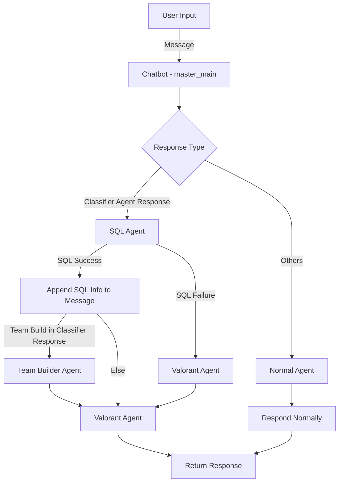

# VCTEVA
Repository for VCT Hackathon: Esports Manager Challenge

## Python Environment Setup

### 1. Conda Environment Set Up

```
conda create --name=eva python=3.10
conda activate eva
pip install -r requirements.txt
```
### 2. Download Dataset From AWS S3 Bucket

```
git clone https://github.com/Kleinpenny/VCTEVA.git
cd /VCTEVA/Data_Preprocess/
python download_dataset.py
```

### 3. Preprocess Dataset

```
cd /VCTEVA/Data_Preprocess/
python main.py
```
#### Processed data stored in /DATA/all.players.json

### 4. 设置AWS Bedrock和LLM客户端

1. 安装AWS CLI
   根据[AWS CLI安装指南](https://docs.aws.amazon.com/cli/latest/userguide/getting-started-install.html)安装AWS CLI。

2. 创建IAM用户
   在AWS控制台的IAM服务中创建一个新用户，并获取该用户的访问凭证（Access Key ID和Secret Access Key）。

3. 配置AWS CLI
   打开终端，运行以下命令：
   ```
   aws configure
   ```
   按照提示输入您的AWS凭证信息。

4. 验证凭证
   运行以下命令验证您的AWS凭证是否正确配置：
   ```
   aws sts get-caller-identity
   ```
   如果凭证有效，您将看到类似以下的输出：
   ```json
   {
       "UserId": "AIDAI...",
       "Account": "123456789012",
       "Arn": "arn:aws:iam::123456789012:user/username"
   }
   ```
   如果凭证无效，您将收到错误消息。

完成以上步骤后，您就可以使用AWS Bedrock服务和选定的LLM客户端了。

### 4. Run the Chatbot

```
python app.py
```

# Project Story

This project implements a flexible and extensible chatbot system that can work with different Large Language Models (LLMs) and incorporate Retrieval-Augmented Generation (RAG) capabilities. The system is designed with modularity and ease of use in mind, allowing for seamless integration of various LLM providers and easy switching between them.


## 系统工作流程

以下流程图展示了我们的聊天机器人系统如何处理用户输入并生成响应：



这个流程图展示了用户输入如何通过不同的代理和决策点进行处理，最终生成适当的响应。


## Project Components

1. **Base LLM Client (base_llm_client.py)**: 
   An abstract base class that defines the interface for all LLM clients. It ensures that all concrete implementations provide a `chat_completion` method.

2. **HuggingFace LLM Client (llm_client.py)**: 
   A concrete implementation of the BaseLLMClient for HuggingFace models. It uses the HuggingFace InferenceClient to interact with models hosted on the HuggingFace platform.

3. **AWS Bedrock LLM Client (aws_bedrock_client.py)**: 
   Another concrete implementation of the BaseLLMClient, this time for AWS Bedrock models. It uses the boto3 library to interact with AWS Bedrock services.

4. **Chatbot (chatbot.py)**: 
   The core class that handles the chat logic. It takes an LLM client as a parameter, allowing it to work with any LLM implementation that follows the BaseLLMClient interface. It also supports an optional RAG interface for enhanced context retrieval.

5. **Gradio Interface (app.py)**: 
   Sets up the user interface using Gradio, creating a chat interface that users can interact with. It initializes the chosen LLM client and the Chatbot, then launches the interface.

## Key Features

- **Modular Design**: The use of a base class for LLM clients allows for easy addition of new LLM providers without changing the core chatbot logic.
- **Flexible LLM Selection**: Users can easily switch between different LLM providers (e.g., HuggingFace, AWS Bedrock) by changing the client initialization in the main function.
- **RAG Support**: The chatbot can optionally use a Retrieval-Augmented Generation interface to enhance responses with relevant context.

## Challenges we ran into
1. 构建怎么样的数据库。